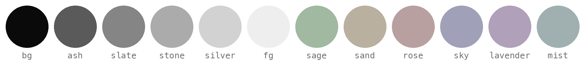

<div align="center">
  <h1>zen.nvim</h1>
</div>

<div align="center">
  <p>
    A minimal, monochromatic colorscheme for Neovim.
    <br/>
    Calm tones. Subtle accents. Zero distractions.
  </p>
</div>

<div align="center">

[](https://neovim.io/)

  
</div>

## Features

- Monochromatic grayscale syntax with muted color accents
- Extensive `TreeSitter` syntax highlighting support
- Compatible with popular plugins
- Extras for terminals and other applications

## Installation

```lua
-- lazy.nvim
{
  "nendix/zen.nvim",
  lazy = false,
  priority = 1000,
}

-- packer.nvim
use "nendix/zen.nvim"
```

## Requirements

- Neovim 0.8+
- Terminal with truecolor support

## Usage

```lua
vim.cmd("colorscheme zen")
```

## Configuration

```lua
require("zen").setup({
  colors = {
    palette = {},  -- override palette colors
    theme = {},    -- override theme colors
  },
})

vim.cmd("colorscheme zen")
```

<details>
<summary><strong>Customization</strong></summary>

Override palette or theme colors:

```lua
require("zen").setup({
  undercurl = true,
  transparent = false,
  dimInactive = false,
  terminalColors = true,
  commentStyle = { italic = true },
  keywordStyle = { italic = true },
  compile = false,
  colors = {
    palette = {},
    theme = {},
  },
  overrides = function(colors)
    return {}
  end,
})

vim.cmd.colorscheme("zen")
```

All palette colors can be found in [lua/zen/colors.lua](lua/zen/colors.lua).

</details>

## Palette

| Category    | Colors                                       |
|-------------|----------------------------------------------|
| Background  | `bg0` `bg1` `bg2` `bg3` `bg4`                |
| Foreground  | `fg` `fg_dim` `fg_muted`                     |
| Grays       | `silver` `stone` `slate` `ash`               |
| Accents     | `sage` `sand` `rose` `sky` `lavender` `mist` |

## Extras

- [Alacritty](extras/alacritty/)
- [Ghostty](extras/ghostty/)
- [Kitty](extras/kitty/)
- [Wezterm](extras/wezterm/)
- [Yazi](extras/yazi/)

## Lualine

```lua
require("lualine").setup({
  options = {
    theme = "zen",
  },
})
```

## Philosophy

Zen prioritizes structure over color. Syntax is distinguished through a
grayscale hierarchy, with muted accents reserved for semantic elements like
strings, types, and constants. The result is a theme that stays out of your
way.

## Credits

Inspired by:
- [kanso.nvim](https://github.com/webhooked/kanso.nvim)
- [ash.nvim](https://github.com/bjarneo/ash.nvim)
